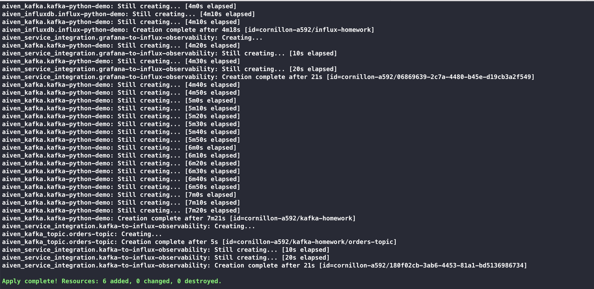
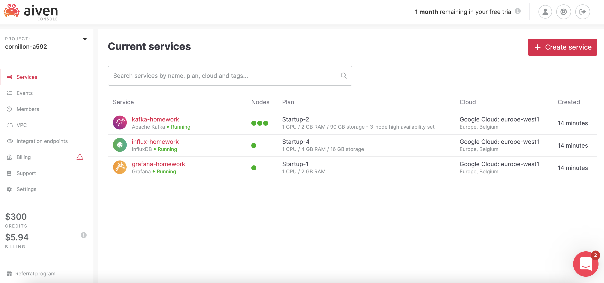
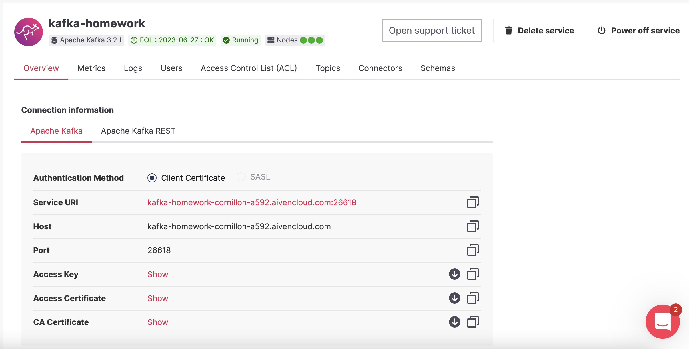
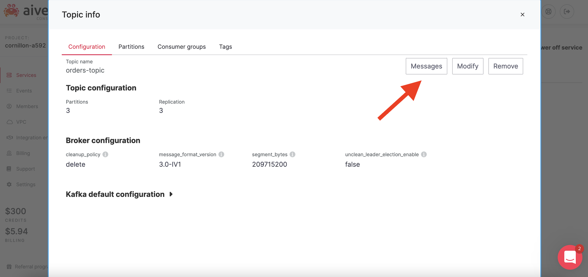
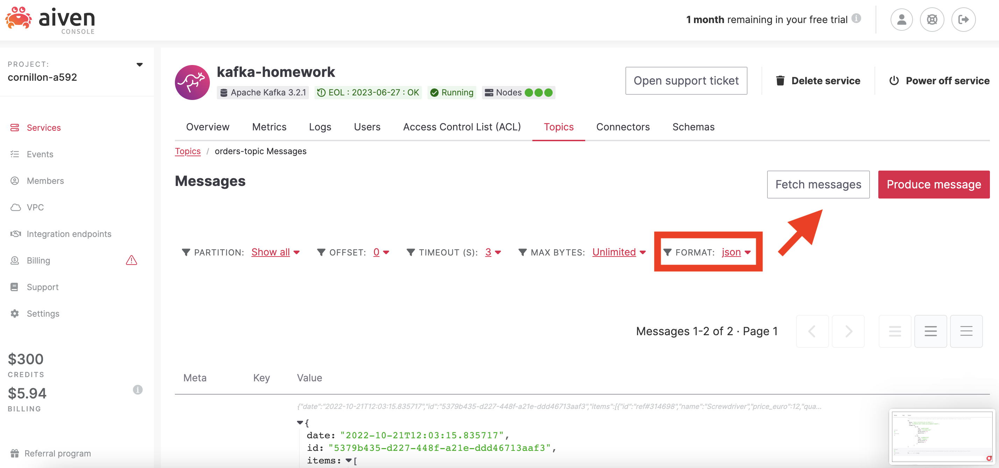

<h1 align="center">
  
</h1>

# Aiven Kafka Quickstart with Python

Kafka is an amazing tool allowing you to build powerful and scalable event-driven architectures.
Python is one of the most popular programming language in recent years.
Let's see how we can use Aiven Kafka managed service and publish some messages using Python, in only a few minutes!

## Deploying the infrastructure

In this quick demo, we will deploy 3 services in our Aiven project:
* A Kafka cluster with a single topic
* An InfluxDB service to store metrics from our Kafka
* And finaly a Grafana service to be able to consult our metrics inside InfluxDB

Thanks to Aiven automation, deploying this fully managed infrastructure will only require a few lines of Terraform code. (Of course, if you prefer to use our [web interface](https://console.aiven.io/), [our REST API](https://docs.aiven.io/docs/tools/api.html) or even our [CLI](https://docs.aiven.io/docs/tools/cli.html), you will achieve the same results!)

Go to the `terraform` repository of this project, and create a `terraform.tfvars` file in which you will specify your Aiven project name and your Aiven API token:

```
aiven_token="******"
aiven_project="my-aiven-project"
```

And that's it, let's apply our terraform!

```
terraform init
terraform apply
```

And ... voilà!

<h1 align="center">
  
  
</h1>

*You want more information on Aiven Terraform Provider? [You can find everything you need here!](https://registry.terraform.io/providers/aiven/aiven/latest/docs)*

## Pushing messages to our Kafka Cluster with Python

In this project, you can find a quickly reusable piece of code that will allow you to connect to your Aiven Kafka service and send a few messages to the topic we created previously.

### How to use it

The `demo.py` is a simple standalone script that make use of the Python kafka library to send messages to your cluster.

```
from kafka import KafkaProducer
```

Before executing our python script, you will need first to retrieve some connection information about your Aiven Kafka cluster: host, port, access key, access certificate and CA certificate. To find those information, go to the service page of your kafka cluster on Aiven console:

<h1 align="center">
  
</h1>

Update the `demo.py` file to configure your kafka host and port:

```
AIVEN_KAFKA_HOST = "kafka-demo-my-aiven-project.aivencloud.com"
AIVEN_KAFKA_SSL_PORT = 26618
```

Then, put the access key, access certificate and CA certificate files at the root of this project.
You are now ready to go!

```
python demo.py
```

You first messages have been published!

```
[Initiating Kafka client]
[Publishing one message to topic orders-topic...]
RecordMetadata(topic='orders-topic', partition=2, topic_partition=TopicPartition(topic='orders-topic', partition=2), offset=0, timestamp=1666297909337, log_start_offset=0, checksum=None, serialized_key_size=-1, serialized_value_size=245, serialized_header_size=-1)
[Publishing one message to topic orders-topic...]
RecordMetadata(topic='orders-topic', partition=1, topic_partition=TopicPartition(topic='orders-topic', partition=1), offset=0, timestamp=1666297909534, log_start_offset=0, checksum=None, serialized_key_size=-1, serialized_value_size=175, serialized_header_size=-1)
```

## Consulting our messages and metrics

Now that we have produce some messages in our Kafka cluster, let's read those in the Aiven console.

Go to you **kafka service page** and under the **"Topics" tab**. Then click on the **"orders-topic"** > **"Message" button** and finaly change the format to **"json"** before hitting the **"Fetch Message" button**.

<h1 align="center">
  
  
</h1>

To conclude this introduction, we will fetch some metrics about our Kafka cluster thanks to Aiven Grafana and InfluxDB integrations.

Go to your Grafana service page, and open the Service URI. 
(To login, use the credentials found on the same service page in the Aiven console).

On the left panel you can go to the "Explore" page, and then you can query every metrics you want!
Here is an example of the `kafka.server:BrokerTopicMetrics.TotalProduceRequestsPerSec.mean` metrics after sending several messages to our Kafka cluster:

<h1 align="center">
  
</h1>

If you want to go deeper on Aiven and Kafka subjects, please see our complete documentation and do not hesitate to browse our technical blog!

[https://aiven.io/kafka](https://aiven.io/kafka)
[https://aiven.io/grafana](https://aiven.io/grafana)
[https://docs.aiven.io/docs/products/kafka/getting-started.html](https://docs.aiven.io/docs/products/kafka/getting-started.html)
[https://aiven.io/blog](https://aiven.io/blog)
